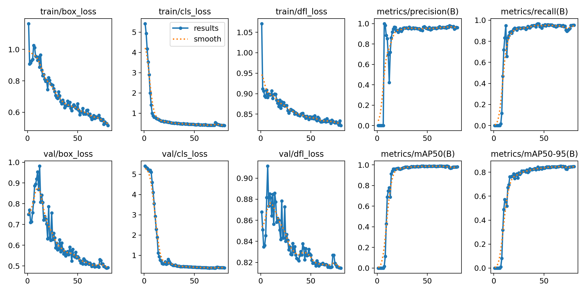
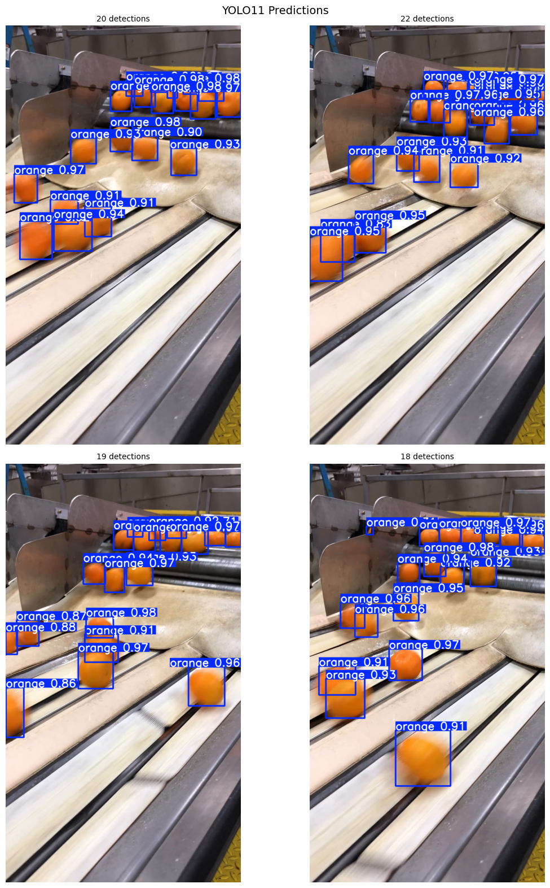

# 🍊 Orange Counter — Conveyor Belt Object Detection & Counting

Real-time orange detection and counting on a conveyor belt using a **fine-tuned YOLO11** model with **Ultralytics ObjectCounter**.

Each orange is detected, tracked, and counted as it crosses a counting line — giving a live count overlay on the video.


## Pipeline

This project follows a complete ML pipeline, from data collection to deployment:

1. **Frame extraction** — Extract frames from the conveyor belt video.
2. **Auto-annotation with Grounding DINO** — Use [Grounding DINO](https://github.com/IDEA-Research/GroundingDINO) (zero-shot object detection) to automatically generate bounding box annotations from a text prompt, eliminating the need for manual labeling from scratch.
3. **Annotation refinement in CVAT** — Import auto-generated annotations into [CVAT](https://www.cvat.ai/) and manually correct errors (split grouped detections, remove false positives, add missed oranges).
4. **Fine-tune YOLO11** — Train a YOLO11n model on the corrected dataset using Google Colab (T4 GPU).
5. **Counting & tracking** — Use Ultralytics ObjectCounter with a user-defined counting line to track and count oranges in real-time.

## Results

The fine-tuned model achieves good performance on the validation set:

| Metric | Value |
|---|---|
| mAP50 | 98.70% |
| mAP50-95 | 85.09% |
| Precision | 95.99% |
| Recall | 94.88% |

### Training Curves



### Predictions on Validation Images



## Quick Start

```bash
# Clone the repo
git clone https://github.com/IIIllllIlIlllII/orange-counter-conveyor-belt.git
cd orange-counter-conveyor-belt

# Python 3.8+ required (recommended: 3.10 or 3.11)
pip install -r requirements.txt
```

Download the trained model weights (`best.pt`) from the [Releases](https://github.com/IIIllllIlIlllII/orange-counter-conveyor-belt/releases) page, or train your own using the provided notebook.

## Usage

```bash
# Interactive — click 2 points to place the counting line
python orange_counter.py --source your_video.mp4 --model best.pt --interactive --save

# With predefined line coordinates
python orange_counter.py --source your_video.mp4 --model best.pt --points 0,613,1077,1076 --save

# Adjust confidence threshold
python orange_counter.py --source your_video.mp4 --model best.pt --points 0,613,1077,1076 --conf 0.5 --save
```

### Arguments

| Argument | Default | Description |
|---|---|---|
| `--source` | `orange_video.mp4` | Path to input video |
| `--model` | `best.pt` | YOLO model weights |
| `--points` | | Line coordinates: `x1,y1,x2,y2` |
| `--interactive` | | Click 2 points on the first frame to place the line |
| `--conf` | `0.6` | Detection confidence threshold |
| `--output` | `output.avi` | Output video path (used with `--save`) |
| `--save` | | Save the annotated output video |
| `--no-show` | | Don't display the video window |

## Training Your Own Model

The notebook `train_from_cvat.ipynb` contains the full training pipeline for Google Colab. It covers uploading your corrected CVAT annotations, splitting the dataset, training YOLO11, evaluating performance, and downloading the trained weights.

To create your own dataset:
1. Extract frames from your video
2. Use Grounding DINO to auto-annotate
3. Import into CVAT, correct the annotations, and export in YOLO 1.1 format
4. Upload to Colab and run `train_from_cvat.ipynb`

## Deployment

Export the model for optimized inference on edge devices or industrial PCs:

```bash
# ONNX (portable — runs on any platform)
yolo export model=best.pt format=onnx half=True

# TensorRT (optimized for NVIDIA GPUs)
yolo export model=best.pt format=engine half=True
```

Then use the exported model directly:

```bash
python orange_counter.py --source your_video.mp4 --model best.onnx --interactive --save
python orange_counter.py --source your_video.mp4 --model best.engine --interactive --save
```

## Project Structure

```
orange-counter-conveyor-belt/
├── orange_counter.py         # Main detection & counting script
├── train_from_cvat.ipynb     # Training notebook (Google Colab)
├── requirements.txt
├── .gitignore
├── LICENSE
├── README.md
└── assets/
    ├── demo.mp4              # Demo video
    ├── training_curves.png   # Training loss & metrics
    ├── predictions.png       # Sample predictions
    └── confusion_matrix.png  # Confusion matrix
```

## Tech Stack

- [Ultralytics YOLO11](https://docs.ultralytics.com/) — Object detection, tracking & counting
- [Grounding DINO](https://github.com/IDEA-Research/GroundingDINO) — Zero-shot auto-annotation
- [CVAT](https://www.cvat.ai/) — Annotation refinement
- [OpenCV](https://opencv.org/) — Video I/O & display
- [Google Colab](https://colab.research.google.com/) — Model training (T4 GPU)

## License

MIT
